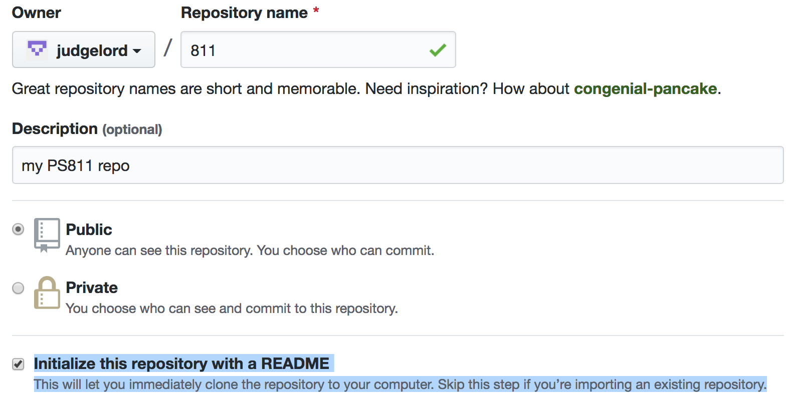
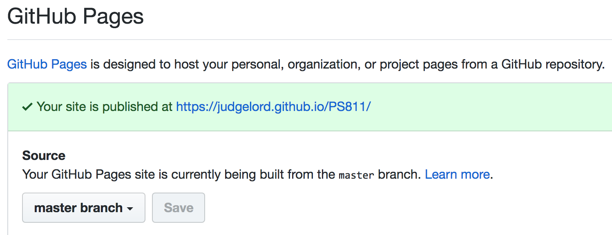

## Getting started with git

Getting started may be a bit of work, but it will save us time the rest of the semester and beyond. I broke down the process into 10 small steps:

1. Sign in to your GitHub.com account, go to the Repository tab, and click on the green "New" button:

2. Name this new repository "811" (not PS811) and initialize with a README.

3. Go to the "Settings" tab, scroll down to "GitHub Pages," and select "master branch" from the "Source" menu.

4. Go to the "Code" tab (your GitHub's main page) and copy the URL of this repository, i.e. https://github.com/YourUserName/811

---

5. Now, to download your new **811** repository:

In RStudio: File -> New Project -> Version Control -> Git -> paste this URL

Note if RStudo does not have that small blue-red-green Git button, RStudio did not find git to be installed. 

6. Also, download the **PS811** class repository. 

7. Move, the `example_portfolio.Rmd` file from the **PS811** folder to your **811** folder on your computer, *then* open it in RStudio.

8. Add your name `Author: "Your Name"` and delete the example text below the line `<!-- Replace the below with bit about you. -->`

9. Save as `portfolio.Rmd` and hit the "Knit" button to make a new HTML: `portfolio.html`.

10. From the blue-red-green Git button menu, select "Commit" and select your new `portfolio.Rmd` and `portfolio.html` files (I would just never commit your 811.R project as it may someday be too large). "Commit" these two files, then "Push" to your GitHub (in the future, you will first "pull" in new changes).

**Tip** Entering these two lines into your terminal/consol/shell will let you skip having to enter your username in the future:

`git config --global user.email "youremail@email.com"`
`git config --global user.name "yourGitHubUserName"`

Your page should soon be live at https://YourUserName.github.io/811/portfolio.html

You are now almost done with Assignment #2. You just need to write a few sentences for the following and repeat steps 8-10 to update your page. 

### Research Interests

### Questions I hope to answer

### Potential methods

### Potentially relevant data